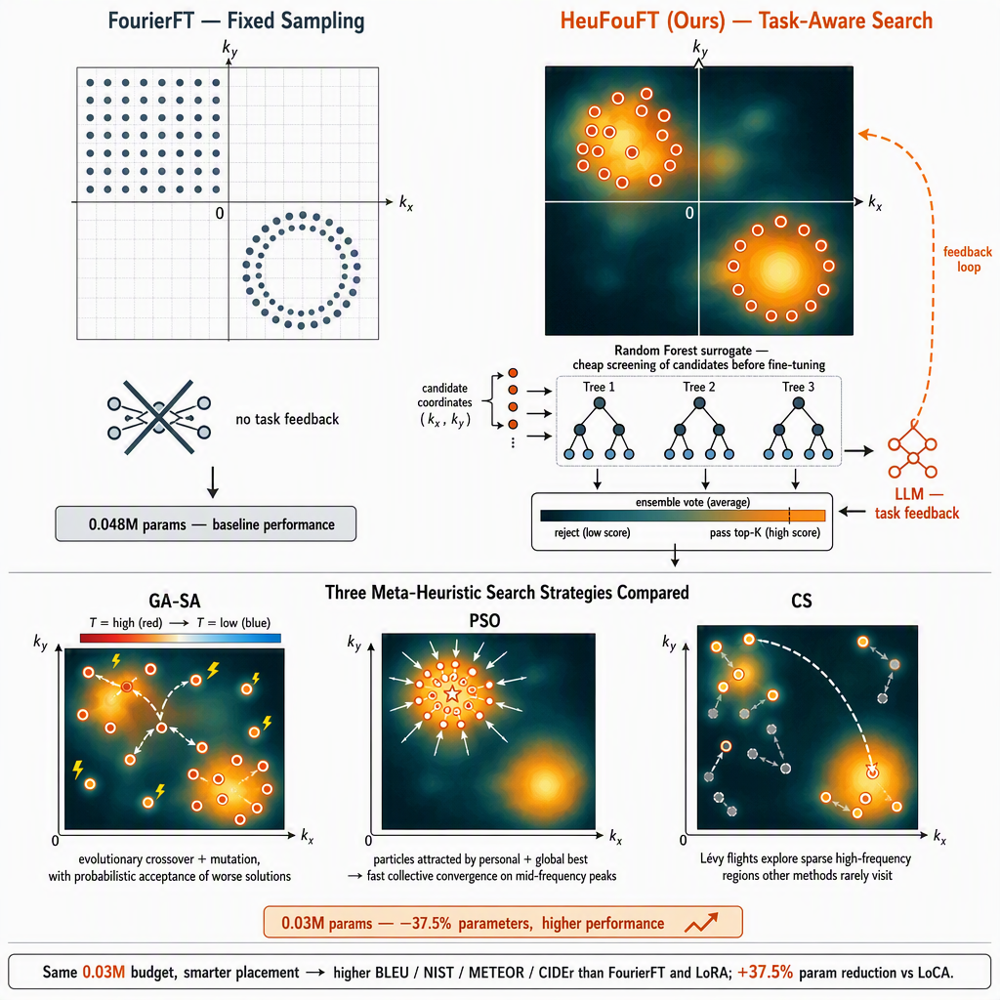

# HeuFouFT: Task-Guided Metaheuristic Coordinate Search for Fourier Fine-Tuning

Official code release for the ICASSP 2027 submission *"Optimizing Fourier
Fine-Tuning with Meta-Heuristic Frequency-Domain Sampling for
Parameter-Efficient LLM Adaptation"*.

Our paper URL: https://arxiv.org/pdf/2610.06437

HeuFouFT treats the selection of trainable Fourier coordinates in
[FourierFT](https://arxiv.org/abs/2405.03003) as an explicit search problem:
a block-level **heuristic intensity map** provides a task-informed prior,
three meta-heuristic searches (**GA-SA**, **PSO**, **CS**) refine individual
coordinates with task feedback, and a **Random Forest surrogate** screens
candidates before they are evaluated with lightweight fine-tuning.

## Method at a glance



*Top: FourierFT (left) places its 0.048M-parameter budget by rigid geometric rules — uniform grid or Gaussian annulus — without consulting the task; HeuFouFT (right) instead reads the heuristic intensity map and concentrates its 0.03M budget on the bright high-value peaks. A Random Forest surrogate screens candidate coordinate sets before they reach the LLM, and the LLM's task feedback closes the loop to update the map. Bottom: the three meta-heuristic searches compared — **GA-SA** uses evolutionary crossover / mutation with a simulated-annealing acceptance that cools from red to blue; **PSO** lets every particle be attracted by both its personal best and the swarm's global best, producing a fast collective convergence on mid-frequency peaks; **CS** uses Lévy flights to occasionally leap across the plane into sparse high-frequency regions that the other methods rarely visit. Same 0.03M budget, smarter placement → higher BLEU / NIST / METEOR / CIDEr than FourierFT and LoRA; a 37.5% smaller budget than LoCA yet stronger on four of five metrics.*

## Repository layout

```
fourier_ft/            FourierFT PEFT implementation (HuggingFace, Apache-2.0)
  sampling.py            + uniform / Gaussian band-pass / fixed-coordinate sampling
data/
  prepare_e2e.py         E2E NLG dataset download & preprocessing
src/
  common.py              shared utilities, Eq. (5) heuristic intensity, lightweight fine-tuning
  train.py               training CLI (FourierFT / HeuFouFT / LoRA / full FT)
  evaluate.py            evaluation CLI (BLEU, NIST, METEOR, ROUGE-L, CIDEr)
  block_probing.py       10x10 block probing -> heuristic intensity map (Sec. 3.1)
  run_search.py          meta-heuristic search entry point (Sec. 3.2)
  spectrum_analysis.py   Figure 1: GPT-2 weight spectra and localized peaks
  search/
    space.py               search space, conjugate pairing, GA bit encoding, PSO move, Levy flights
    ga_sa.py               Genetic Algorithm + Simulated Annealing
    pso.py                 Particle Swarm Optimization (discrete, Eq. 6)
    cs.py                  Cuckoo Search (Levy flights, cosine step decay)
    surrogate.py           Random Forest surrogate
run_all.sh             one-click pipeline
```

## Setup

```bash
pip install -r requirements.txt
python -c "import nltk; nltk.download('punkt'); nltk.download('wordnet'); nltk.download('omw-1.4')"
```

Tested with Python 3.10, PyTorch 2.1+, a single NVIDIA A100 80GB (FP16).
The search and training stages each fit in under 24 GB of GPU memory.

## One-click pipeline

```bash
bash run_all.sh          # PSO (best variant in the paper)
bash run_all.sh ga_sa    # GA-SA
bash run_all.sh cs       # Cuckoo Search
```

The script runs: dataset preparation -> block probing (intensity map) ->
meta-heuristic search -> training with the searched coordinates (0.03M
parameters) -> evaluation on the E2E test set. Each stage is skipped
automatically when its output already exists, so interrupted runs can be
resumed by re-invoking the script.

## Reproducing the experiments

All methods use GPT-2-Medium on the E2E NLG benchmark (42,061 train / 4,672
validation / 4,693 test), AdamW with batch size 4 for three epochs, and the
attention projections `c_attn` / `c_proj` (GPT-2 stores Q, K, V in the fused
`c_attn` matrix; these are the "Q and K projections" of the paper). With
1,000 coefficients per module and 24 layers this gives 0.048M trainable
parameters, matching the FourierFT / LoCA budget in Table 2; HeuFouFT uses
625 coefficients per module (0.03M).

### Table 1: frequency-bias sweep (Gaussian band-pass)

```bash
for FC in 0 100 200 300 400 500; do
  python src/train.py --method fourierft --sampling bandpass --fc ${FC} \
    --bandwidth 20 --n_frequency 1000 --scaling 16.0 \
    --learning_rate 2e-4 --seed 42 --output_dir output/bandpass_${FC}
  python src/evaluate.py --adapter_dir output/bandpass_${FC}/final_adapter \
    --output_dir output/bandpass_${FC}/eval
done
```

### Table 2: main comparison

```bash
# Random-uniform FourierFT (vanilla)
python src/train.py --method fourierft --sampling uniform \
  --n_frequency 1000 --scaling 16.0 --learning_rate 2e-4 --seed 42

# LoRA (rank 8)
python src/train.py --method lora --lora_rank 8 --learning_rate 3e-4 --seed 42

# Full fine-tuning
python src/train.py --method full --learning_rate 5e-5 --seed 42

# HeuFouFT variants (0.03M budget)
bash run_all.sh ga_sa
bash run_all.sh pso
bash run_all.sh cs

# Vanilla GA ablation (GA without the annealing acceptance)
python src/run_search.py --algorithm vanilla_ga --n_frequency 625 ...
```

Each experiment should be repeated with `--seed 41 42 43` to obtain the
mean and standard deviation reported in the paper.

### Figure 1: spectral analysis

```bash
python src/spectrum_analysis.py --model gpt2-medium \
  --output figures/gpt2_fourpanel.pdf
```

## Notes on implementation fidelity

- The `fourier_ft/` package is the HuggingFace PEFT FourierFT implementation
  (Apache-2.0), extended with two sampling modes used by the paper: Gaussian
  band-pass sampling (`sampling="bandpass"`, bias `fc` and bandwidth `W`)
  and fixed coordinate sets (`sampling="indices"`) consumed by the search.
- The original experimental search scripts from the exploratory phase of
  this project were not retained in the internal repository. The search
  module (`src/search/`, `src/run_search.py`, `src/block_probing.py`) is a
  faithful reimplementation of the algorithms **as described in the paper**:
  the GA-SA bit encoding, crossover/mutation rates, and annealing schedule;
  the discrete PSO update of Eq. (6) with the published inertia and
  acceleration constants; the CS Levy-flight exponent and cosine-decayed
  step size; the 10x10 block probing protocol; and the Eq. (5) fitness.
  Absolute metric values may therefore differ slightly from the published
  table, but the method and all hyperparameters follow the paper exactly.
- Evaluation follows the E2E NLG challenge protocol: greedy decoding
  conditioned on the meaning representation, corpus-level BLEU-4 / NIST-4 /
  METEOR / ROUGE-L, and CIDEr.

## Citation

If you use this code, please cite the paper and the FourierFT origin work:

```bibtex
@inproceedings{gao2024fourierft,
  title     = {Parameter-Efficient Fine-Tuning with Discrete Fourier Transform},
  author    = {Gao, Ziqi and Wang, Qichao and Liu, Aochuan and Chen, Yuxin and Zhang, Zhenpeng and Li, Jie},
  booktitle = {Advances in Neural Information Processing Systems (NeurIPS)},
  year      = {2024}
}
```

## License

Apache License 2.0 (the `fourier_ft` package originates from HuggingFace
PEFT, also Apache-2.0). See [LICENSE](LICENSE).
